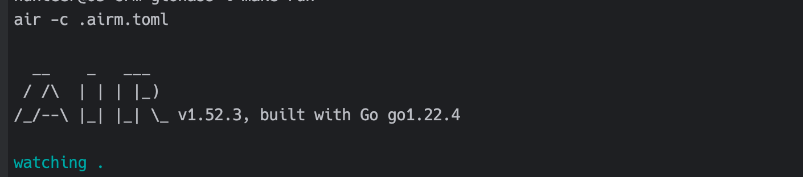

# Comecord CRM REST


REST API service for managing clients, vehicles, monitoring and transport accounting. 

Works with the GLONASS system https://hosting.glonasssoft.ru

## How start 
After you have downloaded the repository, you will need to complete the following steps to start the project.

**Step 1.**

Get repository 
```bash
go mod download
```
**Step 2.** 

Need install docker MongoDB and Redis
```bash
docker-compose up -d
```
or specify the settings in `config/config-development.yml` with your data


**Step 3.**

Download package AIR for GO https://github.com/air-verse/air

```bash
go install github.com/air-verse/air@latest
```

**Star with Air in MacOS / Linux**
```bash
 air -c .airm.toml
```



**Star with Air in Windows**
```bash
 air
```

**Step 4.**

Documentation in OpenAPI can be viewed at this link after launching the project local
http://localhost:5100/swagger/index.html

# Development

Project can be used as a [Pre-Commit](https://pre-commit.com/)To maintain a patch version with each commit, checks will be added in the future.

[ Mac Os ]

Before committing code, this repo has been setup to check Go files using pre-commit git hooks. 
To leverage pre-commit, developers must install pre-commit and associated tools locally (only MacOS):
```bash
brew install pre-commit golangci-lint go-critic
```
Verify install went successfully with:
```bash
pre-commit --version
```
Once you verify pre-commit is installed locally, you can use pre-commit git hooks by installing them in this repo:
```bash
pre-commit install
```

[ Windows ]
 


# CHANGELOG

How to configure and install CHANGELOG written in [GIT-CNGLOG](https://github.com/git-chglog/git-chglog)

```shell
go install github.com/git-chglog/git-chglog/cmd/git-chglog@latest

```


## Swagger Init
<details>
<summary> Install and Update Swagger data</summary>

```markdown
1. go install github.com/swaggo/swag/cmd/swag@v1.16.3
2. go get github.com/swaggo/gin-swagger
3. go get github.com/swaggo/swag
4. go get github.com/swaggo/files
5. swag init -g cmd/main.go
6. swag init -g cmd/main.go --parseDependency --parseInternal
```
</details>

This project is licensed under the Apache License 2.0. See the LICENSE file for details.
